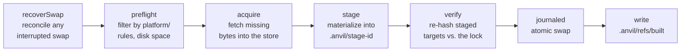

# Architecture

A design overview of `@lobbify/anvil` — not exhaustive, and not a substitute
for reading the module you're changing. Module names below are real paths in
`src/`; when in doubt, the barrel (`index.ts`) of a subsystem is the more
authoritative description than this document.

## The folder is the instance

There is no separate "project" vs. "installed instance" split. Your project
directory **is** a standard, launch-ready `.minecraft` folder:

```text
my-pack/
├── anvil.toml          # the manifest — human-authored, portable, no machine paths
├── anvil.lock          # the fully-pinned lockfile — the sole build input
├── .anvilignore         # extra top-level paths the build must never touch
├── .anvil/              # anvil's own brain (like .git/) — see below
├── mods/                # placed by the build, per the lock
├── resourcepacks/
├── assets/, libraries/, versions/, saves/, …   # standard .minecraft layout
```

`.anvil/` holds everything anvil manages internally: the object model and refs
for its own version control (`src/vc/`), the swap journal and stage
directories used during a build (`src/build/swap.ts`), the per-instance replay
cache (`src/store/replay-cache.ts`), the dependency graph sidecar `anvil why`
reads, and `config.toml` (remotes, path mappings). Heavy shared content
(Mojang assets/libraries/runtime) is deduplicated through a **shared** content
store outside the instance — which can simply *be* an existing
`.minecraft/assets` directory you already have (see path mapping, below).

## Content-addressed store (`src/store/`)

Two domains under one store root (`ContentStore`, `src/store/store.ts`):

- `assets/objects/<xx>/<sha1>` — the **sha1** Mojang-native asset domain, so
  the store can literally *be* an existing `.minecraft/assets`.
- `blobs/objects/<xx>/<sha256>` — the **sha256** domain for everything anvil
  itself owns (mods, resourcepacks, the game jar, loader libraries, the
  generated `version.json`, …).

Because there are two hash algorithms in play, a bare `string` hash is never
passed around — every hash is a `{ algo, value }` pair (`Hash`,
`src/types/core.ts`) so the algorithm tag travels with the value. Objects are
sharded by the first two hex characters of the digest and written `0444`
(read-only), so a link into an instance physically cannot be edited in place.

**Materialization** (`src/store/linking.ts`) prefers to *share bytes* with the
store rather than copy them, falling through a chain: **reflink → hardlink →
symlink → copy**. Reflink/hardlink can't cross filesystem volumes, so a
store/instance device mismatch falls back to a real copy (never a fragile
symlink); symlink is never chosen by default (and never on Windows).

**GC** (`ContentStore.gc`) is mark-sweep: it unions the reachable set from
every locked instance in the on-disk **instance registry**
(`src/store/registry.ts`), plus a short time-based grace window for
just-written-but-not-yet-registered objects, and reclaims everything else.
`fsck` re-hashes every object against its own filename to catch corruption.

**CurseForge bytes never enter this store.** They are a structurally separate
type, `ReplayCache`, living under the instance's own `.anvil/replay-cache/` —
see [Replay-never-rehosted](#replay-never-rehosted-curseforge), below.

## Manifest → resolver → lock

- **Manifest** (`src/manifest/`, `anvil.toml`) — the human-authored input: a
  project header, a `GameSpec` (Minecraft version + loader string, optionally
  `from:` an existing pack to start from), and one flat, declarative `items`
  list. There is deliberately no separate "mods" vs. "resourcepacks" list —
  every item (mod, resourcepack, shader, datapack, local file, whatever) is
  the same `ManifestItem`, either a `source:id@version` ref or a local path;
  its `ItemKind` is inferred, not hand-categorized.
- **Resolver** (`src/resolver/resolve.ts`) — a single-pass BFS worklist over
  the manifest's roots and their transitive dependencies. For every ref
  reached, `allowSource(ref)` is evaluated **before any network I/O** (the
  embedder's veto gate), then the matching `Source.resolve()` runs under a
  **frozen `now` clock**, so a `latest`/omitted version spec is deterministic
  across repeated `anvil lock` runs at the same instant. Identity is a
  canonical key per source (Modrinth slug/id, the final URL, the absolute
  local path, the CurseForge project id), so the same project referenced two
  different ways still dedups to one lock entry. Conflicts are **fail-closed**:
  one resolved version per project; a second demand that the pinned version
  can't satisfy stops the resolve with a typed error naming both demanders. A
  re-lock can also be **constrained** — reusing a prior lock's pins verbatim
  for everything not explicitly `--upgrade`d — which is how Stage 5's VC
  merge/rebase re-lock stays minimal and deterministic.
- **Lock** (`src/lock/`, `anvil.lock`) — the resolver's output: a canonical,
  deterministically-serialized TOML file (`src/lock/serialize.ts`,
  `src/lock/toml.ts`) that is the **sole input to a build**. A build never
  reads the manifest or touches source APIs for anything it already has
  pinned; it only fetches bytes the store doesn't have yet for pins the lock
  already names. Every `LockPackage` row carries everything needed to fetch,
  verify, and place the item byte-identically: its `Hash`, `Placement`,
  `provenance` (`copy` vs. `replay`), and optional platform `targets`.

## Build pipeline (`src/build/`)



1. **Recover** — every build first calls `recoverSwap()` to reconcile any
   swap interrupted by a prior crash, so it always starts from a consistent
   instance.
2. **Preflight** (`preflight.ts`) — filters the lock's packages down to the
   ones that actually apply to this build: per-OS/arch `targets` (natives,
   the JRE), Mojang "rules" evaluation, and a disk-space check.
3. **Acquire** (`acquire.ts`, an injectable `Acquirer`) — fetches only the
   bytes the store is missing; a `--offline` build uses a
   store-only acquirer and fails fast on the first gap instead.
4. **Stage** — the placement executor (`src/store/placement.ts`) turns each
   pinned `LockPackage` into materialized bytes under `.anvil/stage-<id>`, per
   its `Placement` discriminant: `link` (single file), `extract`
   (safe-extracted archive, e.g. natives), `asset-tree` (a full Mojang asset
   index + objects), `runtime-tree` (a per-platform JRE tree, preserving the
   executable bit and mac-bundle symlinks), `store-only` (present in the
   store, nothing placed), or `forge-build` (run the pinned Forge/NeoForge
   installer processors and land their declared `outputs`). Every target path
   is `safeJoin`ed under the instance root — a placement can never escape it.
5. **Verify** — every single-file/asset-index target is re-hashed against its
   pin before the swap commits.
6. **Atomic swap** (`swap.ts`) — see below.
7. **Record** — the built lock is written to `.anvil/refs/built` so the next
   build can compute an incremental delta (`incremental.ts`) instead of
   re-staging everything.

The **game install** itself — `resolveGame()` at lock time, `GameAcquirer` at
build time (`src/game/`) — walks the Mojang version manifest for the client
jar, asset index, and libraries; installs the pinned per-platform Java runtime
as a `runtime-tree`; and, when the manifest names a loader, layers in Fabric or
Quilt (via their meta APIs) or Forge/NeoForge (via that ecosystem's installer,
whose **processors** — the binpatcher, SRG renamer, installertools — run as
pinned build code at build time; see the trust model below). All of it is
merged into one canonical `version.json` (sorted keys, deduped/ordered library
union) so the generated file is as reproducible as anything fetched.

### Atomic swap

The build never leaves a half-installed instance. Changed targets are staged
on the **same volume** as the instance (so the final move is a rename, not a
copy), then installed through a write-ahead journal
(`.anvil/swap.journal`): for each target, move any existing file aside into a
backup, then move the new one in; a single `commit` line is the
linearization point. The journal file and every directory it renames through
are `fsync`ed *before* the commit line is written, so a crash can never roll
forward onto a rename that never actually hit disk. Recovery
(`recoverSwap()`) reconciles an interrupted swap to **fully old** (no commit
line) or **fully new** (commit present) — never a mix. The swap set is built
only from non-protected targets, so `saves/` — and anything else
`.anvilignore` protects — is structurally never part of a swap, at any crash
point.

## anvil's own version control (`src/vc/`)

Not a git wrapper — a small, purpose-built object model and history engine
over the **item-set**, not the raw files:

- **Objects** (`objects.ts`) — sha256-addressed blob / snapshot / commit
  objects, zlib-compressed on disk but **hashed uncompressed**, so a commit id
  is identical across Node 20/22 and every OS.
- **Refs** (`refs.ts`) — `HEAD` / `ORIG_HEAD` / `MERGE_HEAD` /
  `refs/heads|tags|remotes`, a reflog, and packed-refs.
- **Ordering** (`graph.ts`) — a **generation number** is the authoritative
  ordering signal; wall-clock time is display-only and never trusted for
  ancestry or "who's newer."
- **Item-set merge** (`itemset.ts`, `merge.ts`) — a 3-way merge keyed by
  stable identity (`<source>:<id>`, `local:<path>`, `config:<path>`, the
  special `@game` key), followed by a constrained, pin-preserving re-lock
  (untouched items keep their exact prior pins; two branches' *derived* locks
  are never merged directly — only their item-sets are).
- **Rebase** (`rebase.ts`, `repo.ts`) — per-commit item-delta replay with a
  per-step re-lock, `--continue`/`--skip`/`--abort`, and a crash-survivable
  `REBASE_STATE`.

The important framing: **the "layers" of a pack — what was added when — live
in commit history, not in the manifest file.** `anvil.toml` at any given
commit is just the current, flattened item list; the history is what lets you
`log`, `diff`, `revert`, `branch`, and `merge` how that list evolved.

## Remotes (`src/remote/`)

A remote is a descriptor (`descriptor.ts`) stored in `.anvil/config.toml`
under `[remote.<name>]`, backed by one of several transports
(`transport.ts`, `factory.ts`): a writable served **directory** tree, a
read-only **http(s)** base, a **git** repo, or a `lobby://` **room** seam.
`clone`/`pull`/`push` (`sync.ts`) move objects **content-addressed** — local
store → remote endpoint, or remote → local re-fetch-from-source, each
sha-verified on arrival, never trusted on the wire alone. The untrusted
remote's lock is run through `allowSource` and the SSRF checks *before* any
byte moves. **Joiners fast-forward only**: on divergence, local commits are
stashed to a `local/<timestamp>` branch (never discarded) and the pack is
fast-forwarded to the remote's head; `saves/` is untouched by any of it.

## Export (`src/export/`)

`.mrpack` export walks a built instance's lock and writes it back out as a
portable Modrinth pack: `copy`-provenance items become `files[]` entries
(pointing at their original download URL + hash), local items become
`overrides/`, and — per the replay invariant — **CurseForge replay items are
omitted from the export, with a clear warning**, never silently dropped or
silently re-hosted. The zip itself is written by a small dependency-free,
deterministic writer (`zip-write.ts`); reading (import) goes through `yauzl`.

## Trust model

Building a Forge/NeoForge instance runs that installer's processors — real
JVM code — at build time, and anvil runs it **by default** under a deliberate
**trust-the-source** model (the same posture as git hooks, `npm install`
lifecycle scripts, or `docker build` running every `RUN` line). anvil is not a
sandbox against a malicious source you chose to build; what it *does*
guarantee is reproducibility (everything is sha-pinned) and integrity
(SSRF-guarded network I/O, zip-slip/decompression-bomb-guarded extraction) —
not safety from the build code of a source you trusted. Embedders building
from untrusted/remote input get two policy seams, `allowSource` and
`allowProcessor`, plus an injectable `ProcessorRunner` to wrap the JVM in a
real OS sandbox. See [`SECURITY.md`](./SECURITY.md) for the full model.

### Replay-never-rehosted (CurseForge)

CurseForge's terms require its files be fetched by each end user under their
own key, not redistributed. anvil enforces this at the **storage layer**, not
as a flag that's easy to miss in review: `provenance: "replay"` objects
materialize only into the instance-local `.anvil/replay-cache/`
(`src/store/replay-cache.ts`) — a location the shared `ContentStore`, its GC,
the remote transfer code, and `.mrpack` export have no method that can even
enumerate. The lock row for a replay item carries the CurseForge
`{project, file}` identity and a hash to verify against, but no rehostable
download URL; the real URL is re-resolved under the user's own key at fetch
time.
